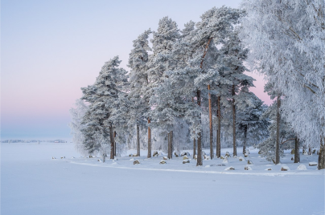

<h1 align="center">Landing Page Inverno</h1>

  

### Tecnologias

Esse projeto foi desenvolvido com as seguintes tecnologias:

- HTML 
- CSS

### Projeto

É o 3º desafio do Projeto Vai na Web. O desafio era fazer uma Landing Page de inverno através do protótipo do figma.

- [Visite o projeto online](https://inverno.vercel.app/)

Esse projeto foi feito por Naah Carvalho ♥
